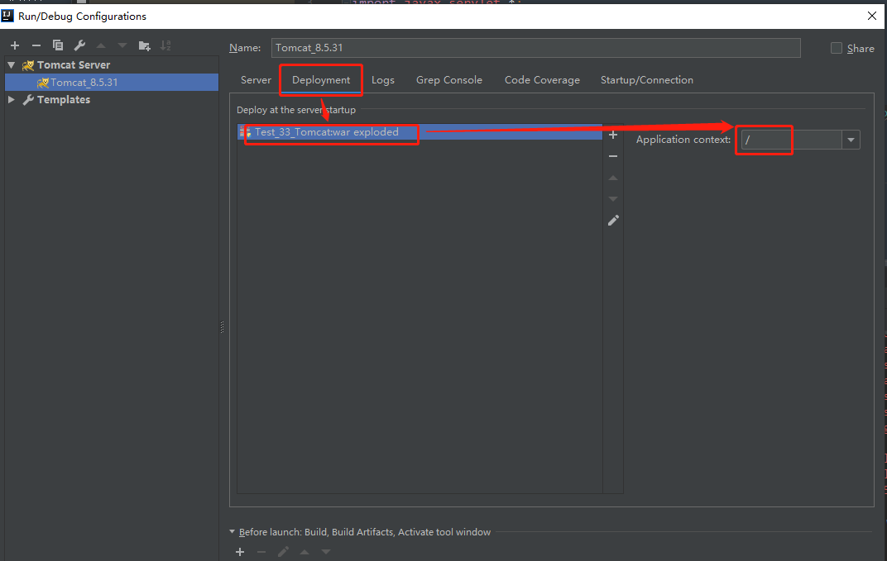

# Vol.33 

## 33.1 web相关

- C/S架构
- B/S架构

- 动态资源
- 静态资源

## 33.2 网络通信三要素

- IP
- 端口
- 协议：UDP、TCP

## 33.3 web服务器软件

web服务器：接收req，处理req，进行response；

常见的java相关web服务器
- webLogic：oracle公司，大型的JavaEE服务器，
    - 支持所有的JavaEE规范，收费的。

- webSphere：IBM公司，大型的JavaEE服务器，
    - 支持所有的JavaEE规范，收费的。

- JBOSS：JBOSS公司的，大型的JavaEE服务器，
    - 支持所有的JavaEE规范，收费的。

- Tomcat：Apache基金组织，中小型的JavaEE服务器，
    - 仅仅支持少量的JavaEE规范servlet/jsp。开源的，免费的。

——————————————————————————————————————————      

## 33.4 Tomcat

Tomcat 8

- bin → 里面都是可执行文件，startup可以启动tomcat服务

- conf → 配置文件 

- lib → 依赖的jar包

- logs → 日志文件

- webapps → 存放web项目

- work  → 存放运行时的数据

——————————————————————————————————————————      

启动tomcat，双击/bin/startup.bat。

> Tips:     
> 1、如果黑窗口一闪而过，说明环境变量JAVA_HOME错了；        
>     配置JAVA_HOME的路径为jdk目录      
> 2、如果报错，一般是端口号被占用导致出错，修改配置文件分配其他的端口号即可。     

——————————————————————————————————————————      

## 33.5 部署项目

- 1、直接放到webapps文件夹下即可。
    - 更简化的方法：将项目打成一个war包，
    - 如何将项目打成war包？
        - 要么直接添加到zip压缩文件，改后缀为war
        - 要么使用专门的war包打包工具。
    
- 2、修改 /conf/serve.xml 文件
    - 在<Host>标签体中写 <Context docBase="D:\hello" path="/hehe" />
		- docBase:项目存放的路径
		- path：虚拟目录，是url访问时的路径

- 3、在conf\Catalina\localhost创建任意名称的xml文件。
    - 在文件中编写 <Context docBase="D:\hello" />
		- docBase:项目路径 
        - path虚拟目录：默认是当前xml文件的名称，是url访问的时候的路径


## 33.6 两种项目

- 静态项目
- 动态项目
    - java项目 → 
        - 配置文件：/WEB-INF
            - /web.xml → web项目的核心配置
            - /classes → 类文件
            - /lib → 依赖的jar包

## 33.7 如何将Tomcat集成到idea中

## 33.8 Servlet

Servlet : Server applet

- Servlet就是一个接口，定义了Java类被浏览器访问到(tomcat识别)的规则。

- 自定义一个类，实现Servlet接口，复写方法，就可以使用Servlet了。

——————————————————————————————————————————      

步骤
- 1、 创建JavaEE项目

- 2、 定义一个类，实现Servlet接口
	- public class ServletDemo1 implements Servlet

——————————————————————————————————————————      

- 3、 实现接口中的抽象方法：生命周期
    - init  : Servlet被创建时，调用init方法，只调用一次。
        - 默认情况，服务被第一次访问的时候，Servlet创建，init被调用；
        - 可以自己配置Servlet创建时机。
        	- 在<servlet>标签下配置<load-on-startup>的值
				1. <0，第一次被访问时创建
			    2. >=0，在服务器启动时创建
        - Tips：init只会调用一次，Servlet在内存中是单例的。
            - 如果多用户同时访问，会有线程安全问题。
            - 所以尽量避免在Servlet中定义成员变量。

    - service : 每次访问Servlet，service方法都会被执行一次。

    - destroy : 当Servlet被销毁时执行，服务器关闭时执行一次。
        - 注意：只有Servlet正常关闭才会调用destroy
        - destroy的执行时机在Servlet销毁之前，所以可以用来释放资源。
——————————————————————————————————————————      

- 4、 配置Servlet
	在web.xml中配置：
    ```xml
    <!--配置Servlet -->
    <servlet>
        <servlet-name>demo1</servlet-name>
        <servlet-class>cn.itcast.web.servlet.ServletDemo1</servlet-class>
    </servlet>

    <servlet-mapping>
        <servlet-name>demo1</servlet-name>
        <url-pattern>/demo1</url-pattern>
    </servlet-mapping>
    ```
——————————————————————————————————————————      

Servlet执行原理：
- 1、 当服务器接受到客户端浏览器的请求后，
    - 会解析请求URL路径，获取访问的Servlet的资源路径

- 2、 查找web.xml文件，是否有对应的<url-pattern>标签体内容。

- 3、 如果有，则在找到对应的<servlet-class>全类名

- 4、 tomcat会将类的字节码文件加载进内存，并且创建其对象

- 5、 调用对应的类方法

——————————————————————————————————————————      

Servlet3.0开始。支持注解配置，可以不需要配置web.xml了。

- 1、 创建JavaEE项目，选择Servlet的版本3.0以上，可以不创建web.xml

- 2、 定义一个类，实现Servlet接口

- 3、 复写Servlet接口的方法

- 4、 在类上使用@WebServlet注解，进行配置
    ```java
	@WebServlet("资源路径")
    ```

> Tips:     
> web.xml主要是维护困难。  
> Java EE 6 以后都可以用注解配置。 

——————————————————————————————————————————      
```java
/*
    当有人访问http://localhost:8080/demo2的时候，
    就会执行service方法。

 */
@WebServlet("/demo2")
public class ServletDemo implements Servlet {
    @Override
    public void init(ServletConfig servletConfig) throws ServletException {}
    @Override
    public ServletConfig getServletConfig() { return null; }

    @Override
    public void service(ServletRequest servletRequest, ServletResponse servletResponse) throws ServletException, IOException {
        System.out.println("Servlet3.0.....");
    }
    @Override
    public String getServletInfo() { return null; }
    @Override
    public void destroy() { }
}
```
```java
/*
    WebServlet注解的各个定义
    如果只传入一个值，默认是value，value 指向了urlPatterns
 */
@Target({ElementType.TYPE})
@Retention(RetentionPolicy.RUNTIME)
@Documented
public @interface WebServlet {
    String name() default "";   // 相当于<Servlet-name>

    String[] value() default {};    // 代表urlPatterns()属性配置

    String[] urlPatterns() default {};  // 相当于<url-pattern>

    int loadOnStartup() default -1; // 相当于<load-on-startup>

    WebInitParam[] initParams() default {};
    boolean asyncSupported() default false;

    String smallIcon() default "";
    String largeIcon() default "";
    String description() default "";
    String displayName() default "";
}
```
——————————————————————————————————————————      

## 33.9 IDEA与tomcat的相关配置

- 1. IDEA会为每一个tomcat部署的项目单独建立一份配置文件
	- 查看控制台的log，可以看到配置文件所在的目录：
    ```cmd
    Using CATALINA_BASE:"C:\Users\fqy\.IntelliJIdea2018.1\system\tomcat\_itcast"
    ```
——————————————————————————————————————————      

- 2. 有两个：工作空间项目 、 tomcat部署的web项目
	- tomcat真正访问的是“tomcat部署的web项目”，
        - "tomcat部署的web项目" 对应着 "工作空间项目" 的web目录下的所有资源

	- WEB-INF目录下的资源不能被浏览器直接访问。
    
——————————————————————————————————————————      

- 3. 断点调试：使用 dubug 启动

——————————————————————————————————————————      

## PS

idea在项目中使用Servlet，需要配置几个东西
- 1、Run - Edit Configurations - Add new Configuration - Tomcat
    - 然后配置Tomcat程序的路径；
    - 在Server栏中，可以配置默认端口号之类的东西。
    - 在Deployment中，需要配置Deploy at the server startup，
        - Add - Artifact - 选中当前的那个Project名称
        - 此时Deployment里面会多出一个： xxx:war exploded

        - Tips：如果Deployment设置里面是空的，访问指定url不会有效果（踩到的坑）。



```java
/** 
    注解 @WebServlet("/abc")，Tomcat端口号1999，
    当前ServletDemo类访问http://localhost:1999/abc的时候，
    service函数会被执行。

    初次访问 http://localhost:1999/abc ，会打印init...和run...
  */
@WebServlet("/abc")
public class ServletDemo implements Servlet {
    @Override
    public void init(ServletConfig servletConfig) throws ServletException {
        System.out.println("init..");
    }

    @Override
    public ServletConfig getServletConfig() { return null; }

    @Override
    public void service(ServletRequest servletRequest, ServletResponse servletResponse) throws ServletException, IOException {
        System.out.println("run..");
    }

    @Override
    public String getServletInfo() { return null; }

    @Override
    public void destroy() {
        System.out.println("destroy..");
    }
}
```
——————————————————————————————————————————      

- 2、右键当前项目的根目录
    - Open Module Settings - Libraries(最左侧菜单) - 点中间菜单左上角的 + 号 - 弹出菜单选中java
    - Select Library Files，选中
        - /tomcat/lib/servlet-api.jar
        - /tomcat/lib/tomcat-api.jar

——————————————————————————————————————————      

- 3、如何自动生成Servlet实现代码？
    - ServletDemo.java文件里面，先写定义
    ```java
    public class ServletDemo implements Servlet{

    }
    ```
    - 右键菜单 - Generate... - Override Methods 
        - 选中javax.servlet.Servlet下面的所有方法 - ok
——————————————————————————————————————————      
